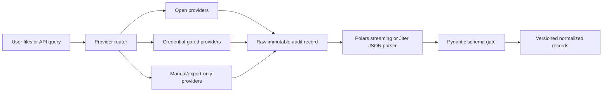
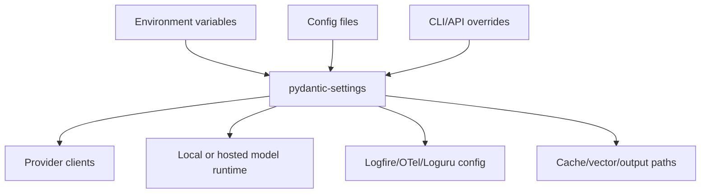
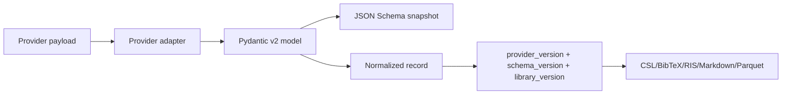
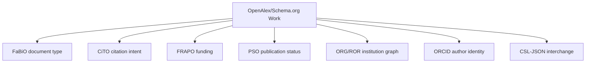
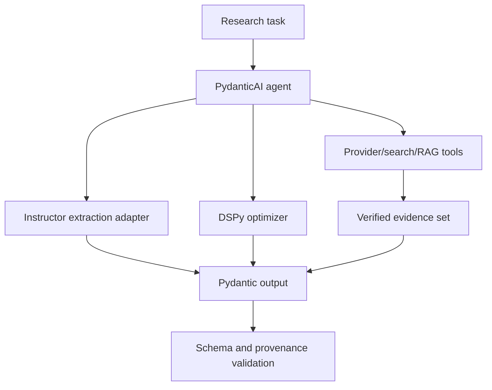
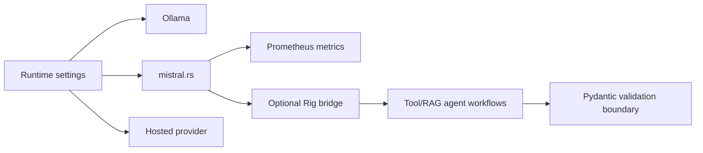
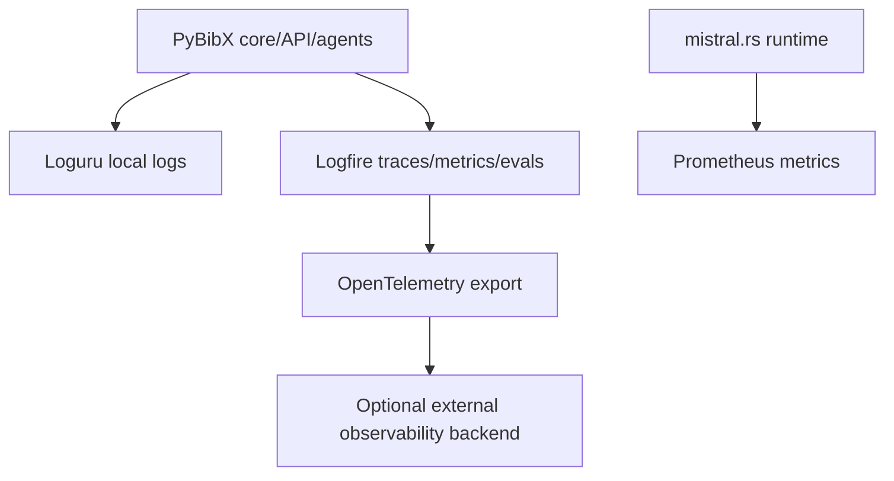
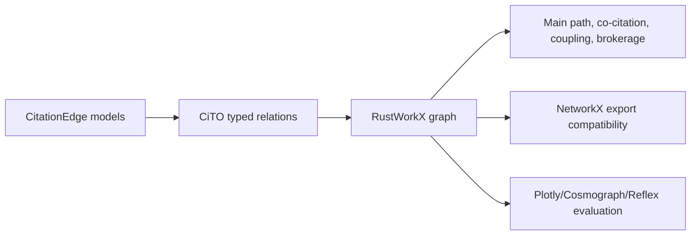
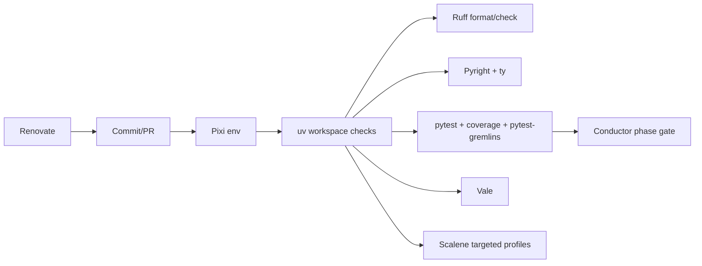

# Design

## Provider Ingestion

## Settings Resolution

## Versioned Schema Gate

## Additive Ontology Model

## Full-Text RAG

```mermaid
flowchart LR
    DOI[DOI or provider work] --> OA[Unpaywall/preprint legality check]
    OA --> PDF[Legal PDF or full text]
    PDF --> Parser[Docling/PDFMux evaluation]
    Parser --> Chunks[Section-aware chunks]
    Chunks --> Embeddings[FastEmbed or local runtime embeddings]
    Embeddings --> LanceDB[LanceDB evidence store]
    LanceDB --> Retriever[LlamaIndex/PydanticAI retriever]
    Retriever --> Claims[Citation-safe structured claims]
```

## Agentic Extraction

## Local Runtime And Rust Bridge

## Observability

## Semantic Graphs

## CI And Tooling

